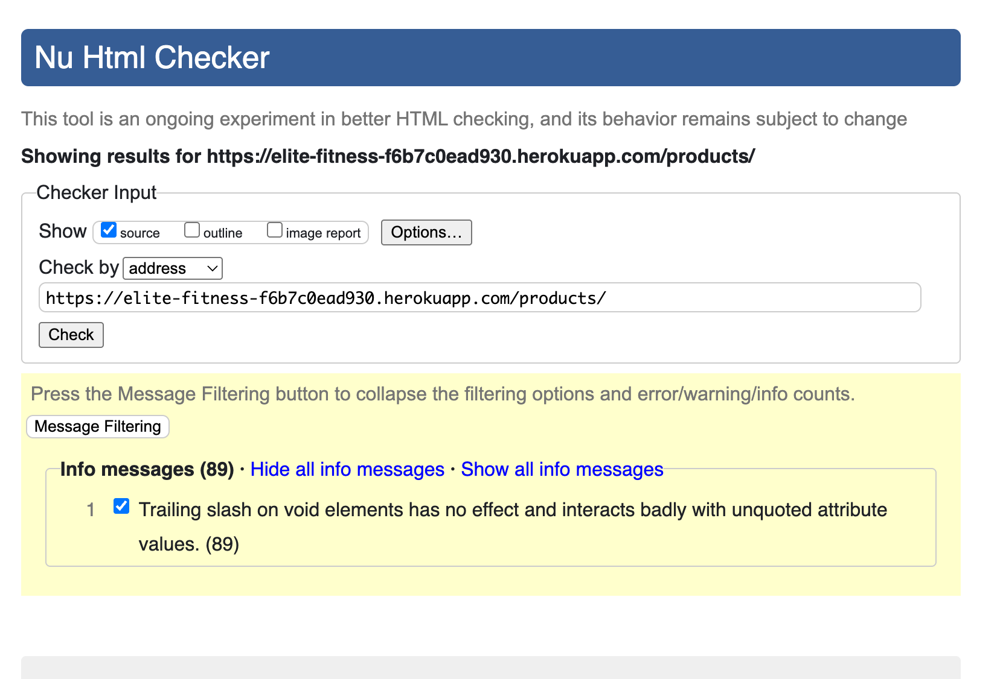
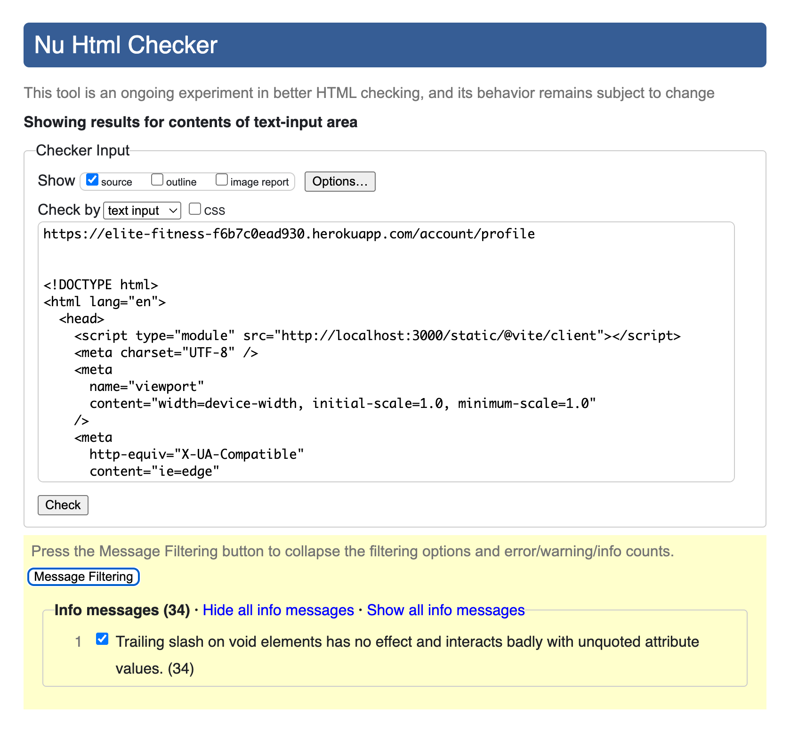
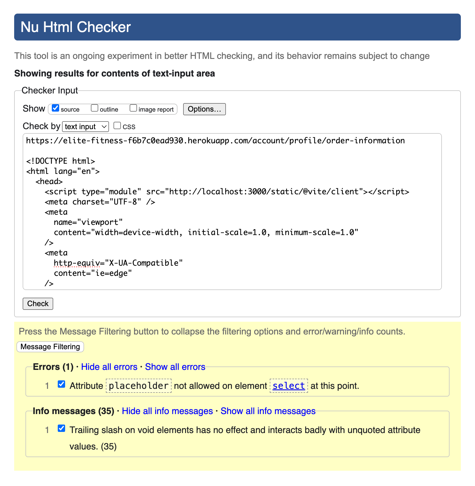
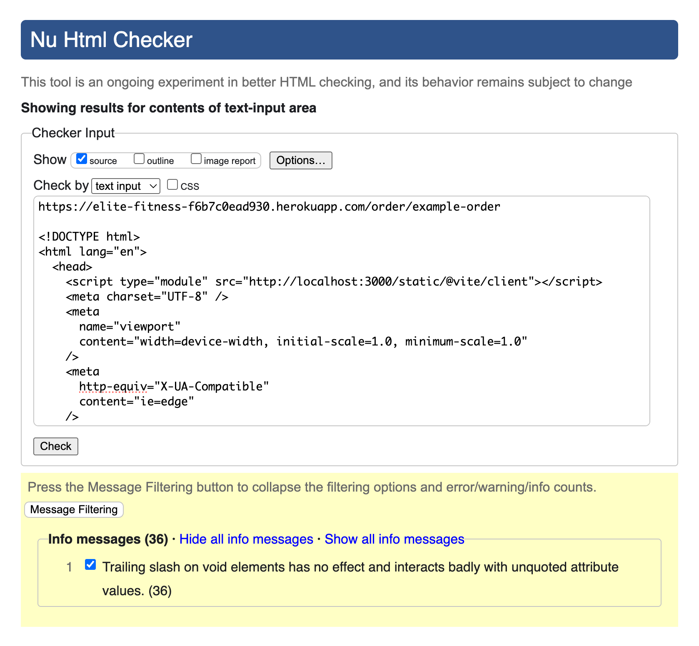
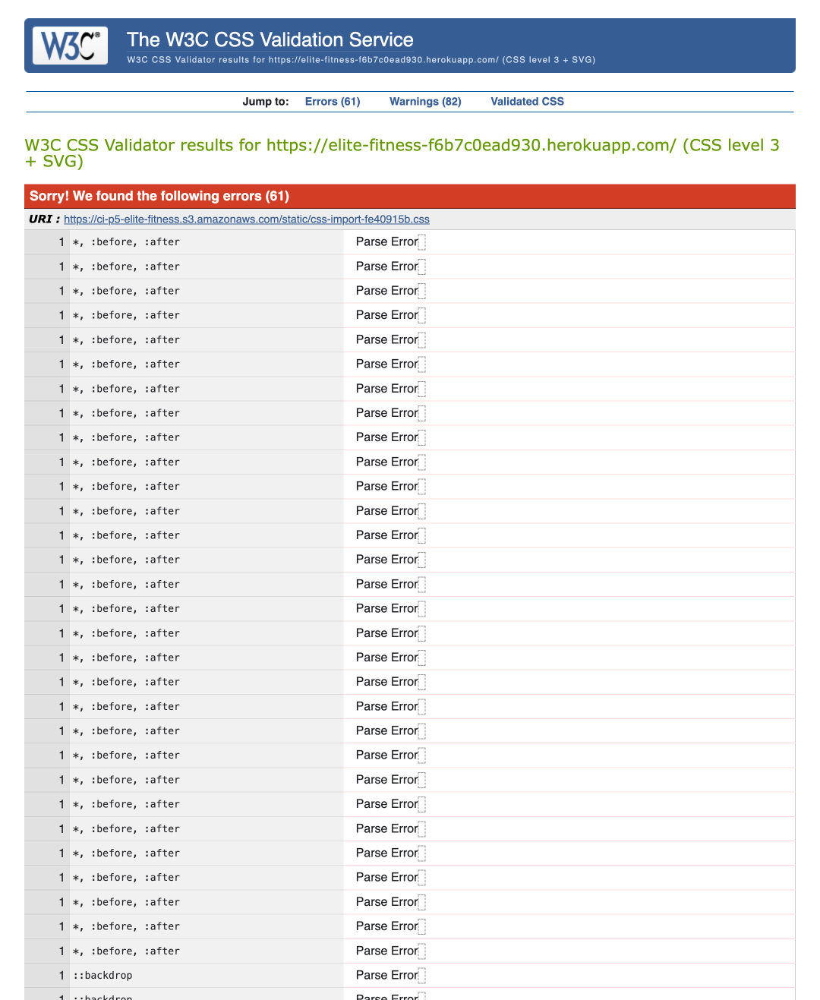

# Testing 🧪

[Navigate back to README Documentation](./README.md)

The testing documentation offers a thorough walkthrough of the website's testing procedures and functionality.
It includes screenshots from various testing stages for visual guidance.
This essential resource assists individuals looking to delve deeper into the testing aspects of the website.
It's arranged into multiple sections, each emphasising a specific testing procedure or function.
The sections included are:


- [Code Validation](#code-validation)
  - [HTML](#html)
  - [CSS](#css)
  - [JavaScript](#javascript)
  - [Python](#python)
- [Browser Compatibility](#browser-compatibility)
- [Responsiveness](#responsiveness)
- [Lighthouse Audit](#lighthouse-audit)
- [Defensive Programming](#defensive-programming)
- [User Story Testing](#user-story-testing)
- [Automated Testing](#automated-testing)
  - [Python (Unit Testing)](#python-unit-testing)
    - [Unit Test Issues](#unit-test-issues)
- [Bugs](#bugs)
  - [GitHub **Issues**](#github-issues)
- [Unfixed Bugs](#unfixed-bugs)

## Code Validation

For Code Validation, I have used the following tools: 🛠️

- [W3C HTML Validator](https://validator.w3.org) Validates HTML code
- [Jigsaw CSS Validator](https://jigsaw.w3.org/css-validator/) Validates CSS code
- [PEP8 CI Python Linter](https://pep8ci.herokuapp.com) Validates Python code
- [JShint JavaScript Validator](https://jshint.com) Validates JavaScript code
- [Eslint](https://eslint.org) for JavaScript linting
- [Ruff python linter](https://pypi.org/project/ruff/) for Python linting & formatting
- [Pycharm Code Inspections](https://www.pylint.org) for Python linting (use pep8 style guide)

### HTML

I have employed the W3C Markup Validation Service, which is the recommended tool for validating all of my HTML files.
The validation process ensures accuracy and adherence to industry standards. To access the validator,
please visit the following URL: [W3C Markup Validation Service](https://validator.w3.org).

> [!IMPORTANT]
>
> **HTML validation info messages**
>
> I utilised the prettier formatter to properly format the HTML, which leads to the inclusion of trailing slashes at the
> conclusion of tags. It is important to note that while this may prompt an informational message in HTML validation
> reports, it does not constitute an error.

| Page                                 | W3C URL                                                                                                                                 | Screenshot                                                                           | Notes                                                           |
| ------------------------------------ | --------------------------------------------------------------------------------------------------------------------------------------- | ------------------------------------------------------------------------------------ | --------------------------------------------------------------- |
| About us                             | [W3C](https://validator.w3.org/nu/?doc=https%3A%2F%2Felite-fitness-f6b7c0ead930.herokuapp.com%2Fsupport%2Fabout%2F)                     |                      | No warnings                                                     |
| Contact Us                           | [W3C](https://validator.w3.org/nu/?doc=https%3A%2F%2Felite-fitness-f6b7c0ead930.herokuapp.com%2Fsupport%2Fcontact%2F)                   |                    | No warnings                                                     |
| FAQS                                 | [W3C](https://validator.w3.org/nu/?doc=https%3A%2F%2Felite-fitness-f6b7c0ead930.herokuapp.com%2Fsupport%2Ffaqs%2F)                      |                          | No warnings                                                     |
| Privacy Policy                       | [W3C](https://validator.w3.org/nu/?doc=https%3A%2F%2Felite-fitness-f6b7c0ead930.herokuapp.com%2Fsupport%2Fprivacy-policy%2F)            |                | No warnings                                                     |
| Products                             | [W3C](https://validator.w3.org/nu/?doc=https%3A%2F%2Felite-fitness-f6b7c0ead930.herokuapp.com%2Fproducts%2F)                            |                      | No warnings                                                     |
| Product Detail                       | [W3C](https://validator.w3.org/nu/?doc=https%3A%2F%2Felite-fitness-f6b7c0ead930.herokuapp.com%2Fproducts%2Fdaily-essentials-for-men%2F) |                | No warnings                                                     |
| Profile Account                      | Validated by input                                                                                                                      |                       | No warnings                                                     |
| Profile Account Delivery Information | Validated by input                                                                                                                      |  | Error fixed on commit: b7a681d334ea03bb01ecee84cb5f1b5faa403d9c |
| Profile Account Orders               | Validated by input                                                                                                                      |                | No warnings                                                     |

### CSS

I have employed the CSS Jigsaw Validator, which is the recommended tool for validating all of my CSS files.
The validation process ensures accuracy and adherence to industry standards. To access the validator,
please visit the following URL: [CSS Jigsaw Validator](https://jigsaw.w3.org/css-validator).

> [!IMPORTANT]
>
> **CSS validation errors**:
>
> This project uses [Tailwind CSS](https://tailwindcss.com), which is a utility-first CSS framework. As such,
> the css is compiled & minified into one css file with [Vite](https://vitejs.dev).
> CSS validation has returned 56 CSS parsing errors. This issue is a result of the final ccs build using Tailwindcss.
> The maintainer of TailwindCSS has discussed this issue and provided a solution;
> however, the recommended fix cannot be used as it is causing issues with the styles used within the application.
> [Remove --tw- variables from universal selector #7317](https://github.com/tailwindlabs/tailwindcss/discussions/7317)

| File                                                 | Jigsaw URL                           | Screenshot                                                                  | Notes                                                                                          |
|------------------------------------------------------|--------------------------------------|-----------------------------------------------------------------------------|------------------------------------------------------------------------------------------------|
| main.css  [Navigate to file](../static/css/main.css) | [Jigsaw](https://jigsaw.w3.org/css-validator/validator?uri=https%3A%2F%2Felite-fitness-f6b7c0ead930.herokuapp.com&profile=css3svg&usermedium=all&warning=1&vextwarning=&lang=en) |  | Fail: (61) Errors. These errors are due to the --tw- variables from universal mentioned above. |

### JavaScript

I have used the recommended [JShint Validator](https://jshint.com) to validate all of my JS files
along with [ESLint](https://eslint.org) for JavaScript linting.

If using modern JavaScript (ES6) methods, then make sure to include the following
line at the very top of every single JavaScript file (this should remain in your files for submission):

> [!note]
> 
> **ESLint Configuration**
> 
> ```/* jshint esversion: 11 */``` & ```/* jshint asi: true */``` have been added to the top of each JS file for assessment purposes. This allows the JShint validator to recognize modern ES6 methods, such as:
`let`, `const`, `template literals`, `arrow functions (=>)`, etc.

| File                                                                                                                | Screenshot                                                                                                        | Notes           |
|---------------------------------------------------------------------------------------------------------------------|-------------------------------------------------------------------------------------------------------------------|-----------------|
| main.js [Navigate to file](../static/js/main.js)                                                                    |                       | Pass: No Errors |
| stripe.js [Navigate to file](../static/js/stripe.js)                                                                |                     | Pass: No Errors |
| wishlist.js  [Navigate to file](../static/js/wishlist.js)                                                           |                       | Pass: No Errors |
| wishlist_append_to_dialog.js  [Navigate to file](../apps/ecommerce/wishlist/static/js/wishlist_append_to_dialog.js) |  | Pass: No Errors |

